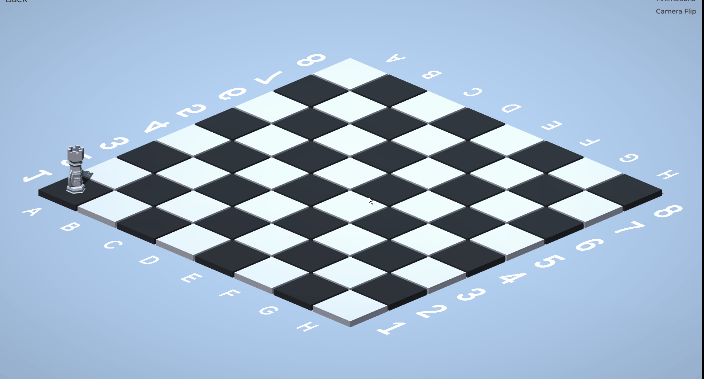

# **Chess**

Chess it's a **local multi-player** game that allows to play the classic strategy board game
in a **3D environment** with piece's animations and amazing visual effects.
Currently the game it's in **alpha** so there is a lot of missing stuff like: the piece's models, 
some game rules, one player game mode, music and more features that are planed.
 
 ## Game preview
 

## Installation
1. Go to the following link to access al [released versions](https://github.com/JoDaniel1412/Chess/releases).
2. Extract the file and execute the Chess.exe

## Developer
**José Acuña** - GitHub: [JoDaniel1412](https://github.com/JoDaniel1412)

## Collaborators
* **Angelo Ortiz** - GitHub: [angelortizv](https://github.com/angelortizv)
* **Alejandro Ibarra** - GitHub: [AlejandroIbarraC](https://github.com/AlejandroIbarraC)
* **Jessica Espinoza** - GitHub: [Jespinoza1703](https://github.com/Jespinoza1703)

## License

This project its under the license (GNU GENERAL PUBLIC LICENSE v3) - read the file 
[LICENSE](LICENSE.md) for more details.

